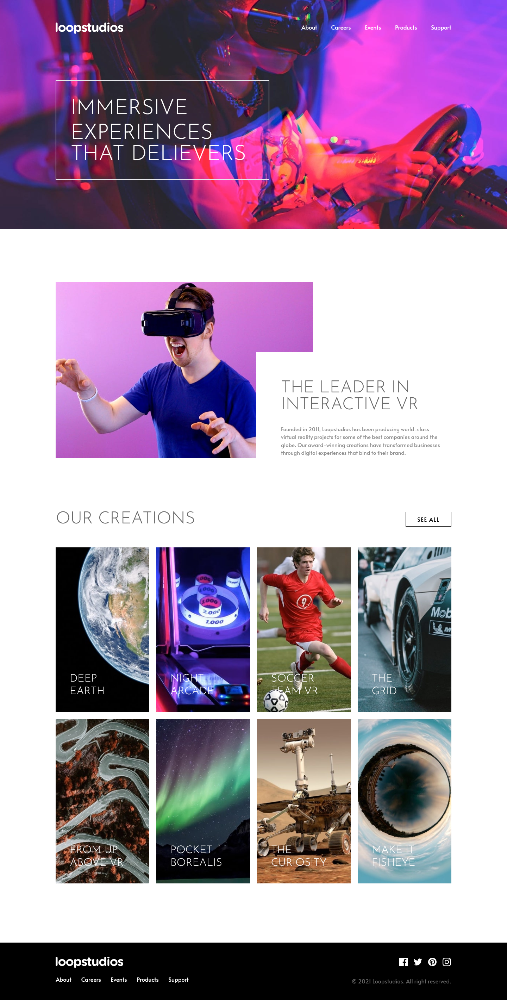

# Frontend Mentor - Loopstudios landing page solution

This is a solution to the [Loopstudios landing page challenge on Frontend Mentor](https://www.frontendmentor.io/challenges/loopstudios-landing-page-N88J5Onjw).

## Table of contents

- [Overview](#overview)
  - [The challenge](#the-challenge)
  - [Screenshot](#screenshot)
  - [Links](#links)
- [My process](#my-process)
  - [Built with](#built-with)
  - [What I learned](#what-i-learned)
  - [Continued development](#continued-development)
  - [Useful resources](#useful-resources)
- [Author](#author)
- [Acknowledgments](#acknowledgments)

## Overview

Loopstudios landing page is purely built with react jsx with a little touch of Javascript in the scrolling and mobile view menu.

### The challenge

Users should be able to:

- View the optimal layout for the site depending on their device's screen size
- See hover states for all interactive elements on the page

### Screenshot

### Links

- Solution URL: [Github solution](https://github.com/olanrewajuyusuf/Loopstudios-landing-page)
- Live Site URL: [Netlify live site](https://wallewdev-loopstudio.netlify.app/)

## My process

### Built with

- Semantic HTML5 markup
- CSS custom properties
- Flexbox
- CSS Grid
- [React](https://reactjs.org/) - JS library
- [Tailwindcss](https://tailwindcss.com/) - For styles

### What I learned

Mastering how to use tailwind.

### Continued development

Still got a lot to learn and i believe i have the ability not to relent.

### Useful resources

- [Tailwind documentation](https://www.tailwindcss.com) - This helped me when i stucked wile using tailwindcss.

## Author

- Website - [wallew_dev](https://www.wallewdev.netlify.app)
- Frontend Mentor - [@olanrewajuyusuf](https://www.frontendmentor.io/profile/olanrewajuyusuf)
- Twitter - [@WaliyyullahY](https://www.twitter.com/WaliyyullahY)

## Acknowledgments

Thanks to frontend mentor always and its crew..
